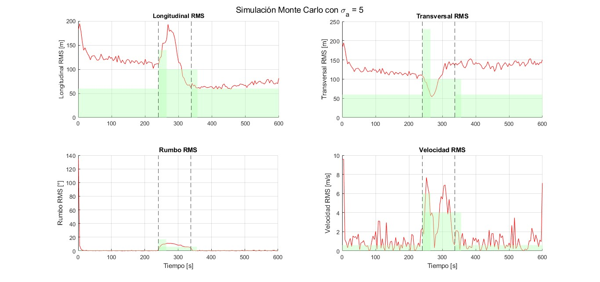
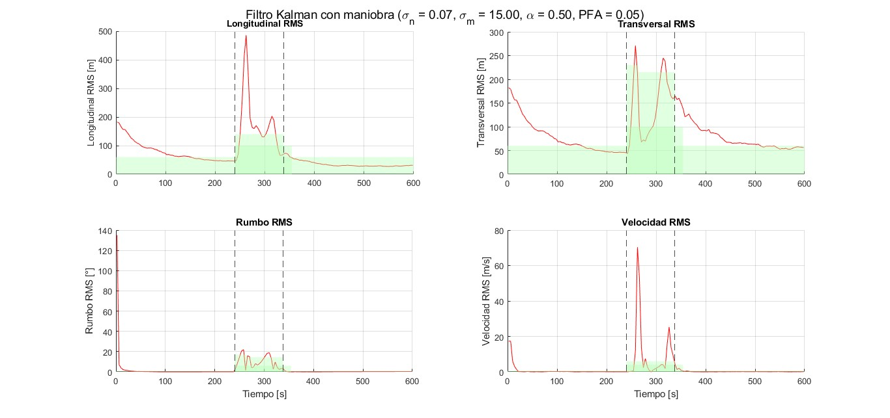

# TRAYECTORIA GIRO:

## MONTECARLO CON KALMAN_CV

---
### Análisis por Tramos y Transiciones (σₐ = 5.0)

| # | Tipo              | Duración (s) | Long (RMS / Max) | Trans (RMS / Max) | Vel (RMS / Max) | Rumbo (RMS / Max) |
|----|-------------------|--------------|-------------------|--------------------|------------------|--------------------|
|  1 | uniforme          |      240.0 |  124.82 / 60      |  124.52 / 60       |   2.10 / 0.6     |  17.46 / 0.7     |
|  2 | uniforme_giro     |       24.0 |  138.59 / 140     |   91.94 / 230      |   5.35 / 6.0     |   8.00 / 17.0    |
|  3 | giro              |       98.0 |  133.48 / 100     |  107.88 / 100      |   4.48 / 4.0     |   8.56 / 6.0     |
|  4 | giro_uniforme     |       18.4 |   66.42 / 100     |  139.98 / 100      |   1.78 / 4.0     |   1.33 / 6.0     |
|  5 | uniforme          |      262.0 |   67.49 / 60      |  139.25 / 60       |   1.48 / 0.6     |   0.53 / 0.7     |
### Porcentaje de Incumplimiento EUROCONTROL (σₐ = 5.0)

| Segmento           | Duración (s) | Longitud (%) | Transversal (%) | Velocidad (%) | Rumbo (%) |
|--------------------|--------------|----------------|-------------------|----------------|------------|
| uniforme           |      240.0 |        100.0 |           100.0 |          60.0 |       10.0 |
| uniforme_giro      |       24.0 |         50.0 |             0.0 |          33.3 |        0.0 |
| giro               |       98.0 |         72.0 |            56.0 |          44.0 |       72.0 |
| giro_uniforme      |       18.4 |          0.0 |           100.0 |           0.0 |        0.0 |
| uniforme           |      262.0 |         92.4 |           100.0 |          57.6 |       12.1 |

---
### Resultados de incumplimiento para distintos valores de σₐ según segmentos (Kalman CV)

| Duracion | %Long   | %Trans  | %Vel   | %Rumbo  | Sigma | Segmento        |
|----------|---------|---------|--------|---------|--------|------------------|
| 240.000  | 55.000  | 55.000  | 30.000 | 11.667  | 0.05  | uniforme         |
| 98.000   | 88.000  | 84.000  | 28.000 | 88.000  | 0.05  | uniforme_giro    |
| 98.000   | 92.000  | 88.000  | 32.000 | 96.000  | 0.05  | giro             |
| 98.368   | 100.000 | 100.000 | 100.000| 88.000  | 0.05  | giro_uniforme    |
| 262.000  | 92.424  | 95.455  | 98.485 | 75.758  | 0.05  | uniforme         |
| 240.000  | 53.333  | 53.333  | 16.667 | 6.667   | 0.10  | uniforme         |
| 98.000   | 88.000  | 84.000  | 36.000 | 88.000  | 0.10  | uniforme_giro    |
| 98.000   | 92.000  | 88.000  | 36.000 | 96.000  | 0.10  | giro             |
| 70.387   | 100.000 | 100.000 | 100.000| 83.333  | 0.10  | giro_uniforme    |
| 262.000  | 57.576  | 100.000 | 96.970 | 48.485  | 0.10  | uniforme         |
| 240.000  | 100.000 | 100.000 | 20.000 | 13.333  | 0.50  | uniforme         |
| 60.459   | 81.250  | 37.500  | 37.500 | 81.250  | 0.50  | uniforme_giro    |
| 98.000   | 92.000  | 88.000  | 68.000 | 96.000  | 0.50  | giro             |
| 38.408   | 60.000  | 80.000  | 80.000 | 30.000  | 0.50  | giro_uniforme    |
| 262.000  | 12.121  | 100.000 | 34.848 | 16.667  | 0.50  | uniforme         |
| 240.000  | 100.000 | 100.000 | 18.333 | 6.667   | 0.80  | uniforme         |
| 52.462   | 78.571  | 21.429  | 28.571 | 78.571  | 0.80  | uniforme_giro    |
| 98.000   | 92.000  | 84.000  | 76.000 | 96.000  | 0.80  | giro             |
| 30.414   | 50.000  | 50.000  | 62.500 | 25.000  | 0.80  | giro_uniforme    |
| 262.000  | 7.576   | 100.000 | 33.333 | 12.121  | 0.80  | uniforme         |
| 240.000  | 100.000 | 100.000 | 20.000 | 13.333  | 1.00  | uniforme         |
| 48.464   | 76.923  | 15.385  | 38.462 | 76.923  | 1.00  | uniforme_giro    |
| 98.000   | 92.000  | 80.000  | 72.000 | 96.000  | 1.00  | giro             |
| 30.414   | 37.500  | 75.000  | 50.000 | 25.000  | 1.00  | giro_uniforme    |
| 262.000  | 7.576   | 100.000 | 25.758 | 9.091   | 1.00  | uniforme         |
| 240.000  | 100.000 | 100.000 | 35.000 | 11.667  | 2.00  | uniforme         |
| 36.466   | 70.000  | 0.000   | 40.000 | 60.000  | 2.00  | uniforme_giro    |
| 98.000   | 88.000  | 56.000  | 72.000 | 96.000  | 2.00  | giro             |
| 22.419   | 0.000   | 100.000 | 0.000  | 16.667  | 2.00  | giro_uniforme    |
| 262.000  | 40.909  | 100.000 | 37.879 | 7.576   | 2.00  | uniforme         |
| 240.000  | 100.000 | 100.000 | 70.000 | 16.667  | 5.00  | uniforme         |
| 24.466   | 57.143  | 0.000   | 28.571 | 0.000   | 5.00  | uniforme_giro    |
| 98.000   | 68.000  | 56.000  | 60.000 | 80.000  | 5.00  | giro             |
| 18.422   | 0.000   | 100.000 | 20.000 | 0.000   | 5.00  | giro_uniforme    |
| 262.000  | 96.970  | 100.000 | 50.000 | 12.121  | 5.00  | uniforme         |
| 240.000  | 100.000 | 100.000 | 81.667 | 18.333  | 7.00  | uniforme         |
| 24.466   | 42.857  | 0.000   | 42.857 | 0.000   | 7.00  | uniforme_giro    |
| 98.000   | 72.000  | 52.000  | 44.000 | 64.000  | 7.00  | giro             |
| 18.422   | 0.000   | 100.000 | 20.000 | 0.000   | 7.00  | giro_uniforme    |
| 262.000  | 100.000 | 100.000 | 65.152 | 19.697  | 7.00  | uniforme         |
| 240.000  | 100.000 | 100.000 | 86.667 | 41.667  | 10.00 | uniforme         |
| 20.465   | 66.667  | 0.000   | 16.667 | 0.000   | 10.00 | uniforme_giro    |
| 98.000   | 72.000  | 60.000  | 28.000 | 44.000  | 10.00 | giro             |
| 18.422   | 0.000   | 100.000 | 0.000  | 0.000   | 10.00 | giro_uniforme    |
| 262.000  | 100.000 | 100.000 | 83.333 | 22.727  | 10.00 | uniforme         |
| 240.000  | 100.000 | 100.000 | 98.333 | 51.667  | 15.00 | uniforme         |
| 20.465   | 100.000 | 0.000   | 50.000 | 0.000   | 15.00 | uniforme_giro    |
| 98.000   | 72.000  | 60.000  | 28.000 | 4.000   | 15.00 | giro             |
| 18.422   | 0.000   | 100.000 | 20.000 | 0.000   | 15.00 | giro_uniforme    |
| 262.000  | 100.000 | 100.000 | 83.333 | 48.485  | 15.00 | uniforme         |

---
Mejores sigmas por segmento:
-  giro: 15
-  giro_uniforme: 10
-  uniforme: 0.1
-  uniforme_giro: 10

**Mejor sigma global: 5**

---

## KALMAN MANIOBRA

### Comparación de valores de los parámetros

TOP 10 resultados por combinación:

 Resultados completos por combinación:
|   σₐ_n |   σₐ_m |     α |     PFA |  RMS total | % Incumpl. |
|--------|--------|------|---------|------------|-------------|
|   0.07 |   15.0 | 0.50 | 5.0e-02 |      42.01 |      29.86 |
|   0.07 |   14.0 | 0.60 | 1.0e-01 |      43.30 |      30.28 |
|   0.04 |   14.0 | 0.50 | 7.0e-02 |      41.39 |      30.56 |
|   0.05 |   19.0 | 0.50 | 5.0e-02 |      41.63 |      30.59 |
|   0.05 |   10.0 | 0.50 | 7.0e-02 |      42.08 |      30.69 |
|   0.07 |   20.0 | 0.50 | 1.0e-01 |      41.29 |      30.80 |
|   0.05 |   17.0 | 0.40 | 5.0e-02 |      41.72 |      30.83 |
|   0.07 |   17.0 | 0.40 | 5.0e-02 |      41.63 |      30.83 |
|   0.06 |   19.0 | 0.50 | 5.0e-02 |      41.76 |      31.01 |
|   0.07 |   14.0 | 0.40 | 7.0e-02 |      41.64 |      31.01 |
---

 MEJOR COMBINACIÓN ENCONTRADA:
- σₐ_normal   = 0.07
- σₐ_maniobra = 15.0
- α           = 0.50
- PFA         = 5.0e-02
- RMS total   = 42.01
- % Incumpl.  = 29.86%

### Análisis por Tramos y Transiciones (Filtro con Maniobra mejor combi)

| # | Tipo              | Duración (s) | Long (RMS / Max) | Trans (RMS / Max) | Vel (RMS / Max) | Rumbo (RMS / Max) |
|----|-------------------|--------------|-------------------|--------------------|------------------|--------------------|
|  1 | uniforme          |      240.0 |   87.30 / 60      |   87.16 / 60       |   3.29 / 0.6     |  17.47 / 0.7     |
|  2 | uniforme_giro     |       24.0 |  288.29 / 140     |  173.60 / 230      |  29.13 / 6.0     |  14.42 / 17.0    |
|  3 | uniforme_giro     |       74.0 |  169.44 / 140     |  151.93 / 215      |  15.39 / 6.0     |  11.12 / 14.5    |
|  4 | giro              |       98.0 |  205.69 / 100     |  157.62 / 100      |  19.74 / 4.0     |  12.03 / 6.0     |
|  5 | giro_uniforme     |       16.3 |   69.10 / 100     |  158.22 / 100      |   2.46 / 4.0     |   1.55 / 6.0     |
|  6 | uniforme          |      262.0 |   37.63 / 60      |   83.99 / 60       |   0.62 / 0.6     |   0.43 / 0.7     |

### Porcentaje de Incumplimiento EUROCONTROL para mejor combi

| Segmento           | Duración (s) | Longitud (%) | Transversal (%) | Velocidad (%) | Rumbo (%) |
|--------------------|--------------|----------------|-------------------|----------------|------------|
| uniforme           |      240.0 |         61.7 |            61.7 |           8.3 |       13.3 |
| uniforme_giro_1    |       24.0 |         66.7 |            16.7 |          33.3 |       33.3 |
| uniforme_giro_2    |       74.0 |         66.7 |            16.7 |          38.9 |       27.8 |
| giro               |       98.0 |         79.2 |            62.5 |          41.7 |       66.7 |
| giro_uniforme      |       16.3 |          0.0 |           100.0 |          20.0 |        0.0 |
| uniforme           |      262.0 |          6.1 |            66.7 |           7.6 |        3.0 |

