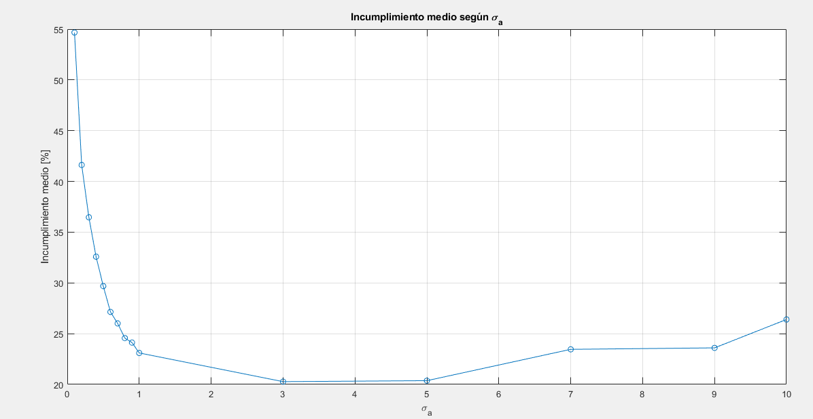

# TRAYECTORIA GIRO:

## CON KALMAN_CV:

## MONTECARLO CON KALMAN_CV VIENDO CON MÁSCARA EUROCONTROL

---

## Análisis por Tramos y Transiciones (σₐ = 3.0)

| # | Tipo              | Duración (s) | Long (RMS / Max) | Trans (RMS / Max) | Vel (RMS / Max) | Rumbo (RMS / Max) |
|----|-------------------|--------------|-------------------|--------------------|------------------|--------------------|
|  1 | uniforme          |      240.0 |    7.97 / 60      |    8.63 / 60       |   1.46 / 0.6     |  17.46 / 0.7     |
|  2 | uniforme_giro     |       24.0 |   70.88 / 140     |   44.77 / 230      |   5.01 / 6.0     |   9.77 / 17.0    |
|  3 | uniforme_giro     |        8.6 |  176.73 / 140     |   29.68 / 215      |   6.23 / 6.0     |  14.93 / 14.5    |
|  4 | giro              |       98.0 |  112.00 / 100     |   83.17 / 100      |   6.07 / 4.0     |  11.65 / 6.0     |
|  5 | giro_uniforme     |       22.5 |   25.97 / 100     |   11.80 / 100      |   3.06 / 4.0     |   2.10 / 6.0     |
|  6 | uniforme          |      262.0 |    7.99 / 60      |   13.19 / 60       |   1.23 / 0.6     |   0.66 / 0.7     |
## Porcentaje de Incumplimiento EUROCONTROL (σₐ = 3.0)

| Segmento           | Duración (s) | Longitud (%) | Transversal (%) | Velocidad (%) | Rumbo (%) |
|--------------------|--------------|----------------|-------------------|----------------|------------|
| uniforme           |      240.0 |          0.0 |             0.0 |          48.3 |        8.3 |
| uniforme_giro_1    |       24.0 |          0.0 |             0.0 |          50.0 |        0.0 |
| uniforme_giro_2    |        8.6 |        100.0 |             0.0 |          33.3 |       66.7 |
| giro               |       98.0 |         40.0 |            32.0 |          64.0 |       96.0 |
| giro_uniforme      |       22.5 |          0.0 |             0.0 |           0.0 |        0.0 |
| uniforme           |      262.0 |          0.0 |             1.5 |          48.5 |       10.6 |

---
### COMPARACIÓN DE INCUMPLIMIENTO PARA DISTINTOS σ_a 

| σₐ   | Long (%) | Trans (%) | Vel (%) | Rumbo (%) |
|------|----------|-----------|---------|-----------|
| 0.10 |   49.7   |    63.2   |  54.9   |   50.8    |
| 0.20 |   36.2   |    46.5   |  44.9   |   38.9    |
| 0.30 |   32.6   |    38.1   |  39.8   |   35.4    |
| 0.40 |   29.8   |    31.5   |  37.6   |   31.5    |
| 0.50 |   26.7   |    24.4   |  36.4   |   31.2    |
| 0.60 |   24.6   |    21.1   |  32.6   |   30.3    |
| 0.70 |   23.7   |    19.1   |  33.5   |   27.7    |
| 0.80 |   22.7   |    16.3   |  32.0   |   27.3    |
| 0.90 |   21.6   |    15.2   |  32.2   |   27.5    |
| 1.00 |   20.5   |    13.5   |  31.6   |   26.9    |
| **3.00** | **8.5** | **4.9** | **46.3** | **21.3** |
| 5.00 |    2.5   |     0.0   |  58.0   |   21.0    |
| 7.00 |    0.0   |     0.0   |  66.0   |   27.8    |
| 9.00 |    0.0   |     0.0   |  66.5   |   28.0    |
|10.00 |    0.0   |     0.0   |  70.2   |   35.4    |

El mejor valor de σₐ es **3.00** con un incumplimiento medio total del 20.27%

| σₐ       | Comportamiento global                        | Tramos rectos                                 | Tramos de giro                                   | Robustez global |
| -------- | -------------------------------------------- | --------------------------------------------- | ------------------------------------------------ | --------------- |
| **0.5**  | Muy rígido, gran error en maniobras          | Muy bajo error (6 m y 120 m RMS)              | Error muy alto (852 m, 587 m)                    |  Baja         |
| **1.0**  | Más equilibrado, mejora notable en giros     | Bajo error (43 m)                             | Sigue fallando en giros cortos (498 m)           |  Aceptable    |
| **3.0**  | Buen compromiso entre rigidez y flexibilidad | Aumenta ligeramente el error (7–8 m)          | Giros mucho mejor seguidos (113 m)               |  Alta         |
| **5.0**  | Más flexible pero ruido y errores visibles   | Más error en rectas (8.2 m y 4.8 m), aún bajo | Giros suaves, pero pierde precisión (68 m)       |  Media        |
| **10.0** | Muy laxo, pierde precisión en zonas estables | RMS hasta 12.9 m en rectas                    | Sigue bien los giros (27.4 m) pero poco realista |  Muy baja     |

## KALMAN MANIOBRA

σa normal: 0.05, σa maniobra: 10.00, α: 0.20, PFA: 0.05

## Análisis por Tramos y Transiciones (Filtro con Maniobra)

| # | Tipo              | Duración (s) | Long (RMS / Max) | Trans (RMS / Max) | Vel (RMS / Max) | Rumbo (RMS / Max) |
|----|-------------------|--------------|-------------------|--------------------|------------------|--------------------|
|  1 | uniforme          |      240.0 |   57.31 / 60      |   57.47 / 60       |   4.56 / 0.6     |  17.75 / 0.7     |
|  2 | uniforme_giro     |       24.0 |   84.85 / 140     |  109.92 / 230      |  11.42 / 6.0     |   6.31 / 17.0    |
|  3 | uniforme_giro     |       74.0 |  219.81 / 140     |  192.96 / 215      |  21.06 / 6.0     |  18.31 / 14.5    |
|  4 | giro              |       98.0 |  196.08 / 100     |  176.63 / 100      |  19.20 / 4.0     |  16.26 / 6.0     |
|  5 | giro_uniforme     |       26.6 |   51.86 / 100     |   77.09 / 100      |   9.24 / 4.0     |   5.13 / 6.0     |
|  6 | uniforme          |      262.0 |   39.11 / 60      |   45.40 / 60       |   2.90 / 0.6     |   1.61 / 0.7     |

## Porcentaje de Incumplimiento EUROCONTROL

| Segmento           | Duración (s) | Longitud (%) | Transversal (%) | Velocidad (%) | Rumbo (%) |
|--------------------|--------------|----------------|-------------------|----------------|------------|
| uniforme           |      240.0 |         25.0 |            26.7 |          46.7 |       33.3 |
| uniforme_giro_1    |       24.0 |          0.0 |             0.0 |          50.0 |        0.0 |
| uniforme_giro_2    |       74.0 |         47.4 |            15.8 |          52.6 |       52.6 |
| giro               |       98.0 |         56.0 |            40.0 |          60.0 |       72.0 |
| giro_uniforme      |       26.6 |         14.3 |            14.3 |          57.1 |       14.3 |
| uniforme           |      262.0 |         13.6 |            18.2 |          34.8 |       16.7 |

