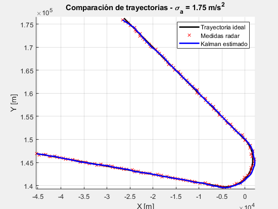
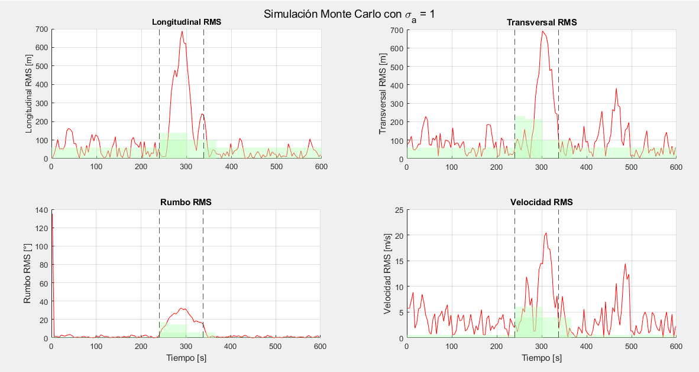
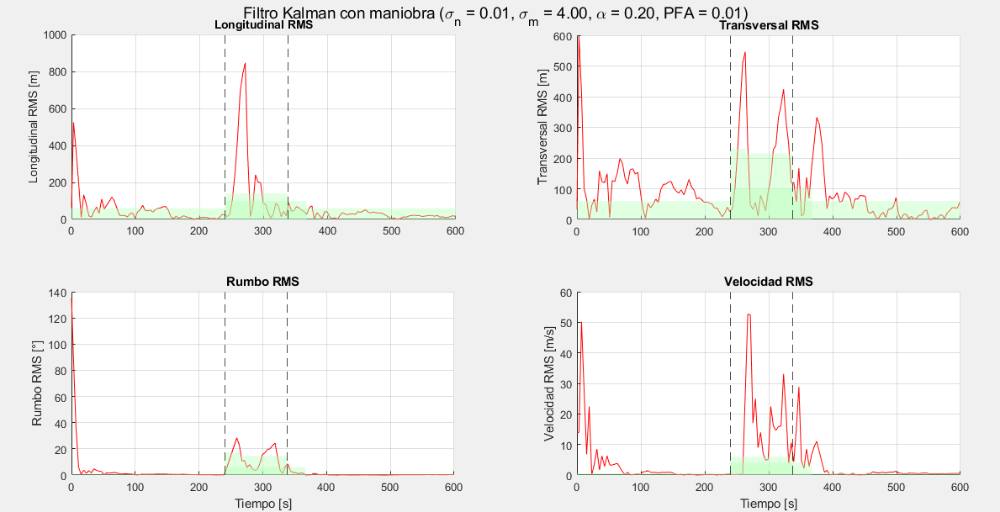

# TRAYECTORIA GIRO:

## CON KALMAN_CV:

## MONTECARLO CON KALMAN_CV VIENDO CON MÁSCARA EUROCONTROL

---

## Análisis por Tramos y Transiciones (σₐ = 1.0)

| # | Tipo              | Duración (s) | Long (RMS / Max) | Trans (RMS / Max) | Vel (RMS / Max) | Rumbo (RMS / Max) |
|----|-------------------|--------------|-------------------|--------------------|------------------|--------------------|
|  1 | uniforme          |      240.0 |   65.19 / 60      |   86.75 / 60       |   7.86 / 0.6     |  17.72 / 0.7     |
|  2 | uniforme_giro     |       24.0 |  244.15 / 140     |  126.52 / 230      |   9.97 / 6.0     |  15.63 / 17.0    |
|  3 | uniforme_giro     |       34.2 |  623.19 / 140     |  237.19 / 215      |   6.92 / 6.0     |  27.53 / 14.5    |
|  4 | giro              |       98.0 |  411.33 / 100     |  331.47 / 100      |  11.24 / 4.0     |  22.41 / 6.0     |
|  5 | giro_uniforme     |       32.1 |  147.02 / 100     |   77.41 / 100      |   3.54 / 4.0     |   6.98 / 6.0     |
|  6 | uniforme          |      262.0 |   64.99 / 60      |  103.28 / 60       |   4.55 / 0.6     |   2.62 / 0.7     |

## Porcentaje de Incumplimiento EUROCONTROL (σₐ = 1.0)

| Segmento           | Duración (s) | Longitud (%) | Transversal (%) | Velocidad (%) | Rumbo (%) |
|--------------------|--------------|----------------|-------------------|----------------|------------|
| uniforme           |      240.0 |         41.7 |            50.0 |          90.0 |       78.3 |
| uniforme_giro_1    |       24.0 |         50.0 |             0.0 |          33.3 |       50.0 |
| uniforme_giro_2    |       34.2 |        100.0 |            44.4 |          44.4 |      100.0 |
| giro               |       98.0 |         79.2 |            70.8 |          70.8 |       95.8 |
| giro_uniforme      |       32.1 |         44.4 |            44.4 |          44.4 |       22.2 |
| uniforme           |      262.0 |         24.2 |            53.0 |          84.8 |       59.1 |

---
### COMPARACIÓN DE INCUMPLIMIENTO PARA DISTINTOS σ_a 

| σₐ   | Longitud (%) | Transversal (%) | Velocidad (%) | Rumbo (%) |
|------|---------------|------------------|----------------|-------------|
| 0.10 | 74.0          | 94.2             | 96.2           | 51.9        |
| 0.20 | 100.0         | 100.0            | 80.0           | 53.3        |
| 0.30 | 78.9          | 100.0            | 76.3           | 39.5        |
| 0.40 | 93.8          | 75.0             | 81.2           | 37.5        |
| 0.50 | 65.6          | 46.9             | 81.2           | 28.1        |
| 0.60 | 55.2          | 51.7             | 86.2           | 31.0        |
| 0.70 | 48.0          | 72.0             | 52.0           | 24.0    |
| 0.80 | 50.0          | 50.0             | 75.0           | 25.0        |
| 0.90 | 37.5          | 50.0             | 87.5           | 25.0        |
| **1.00** | **50.0**     | **25.0**          | **25.0**         | **37.5**        |
| 3.00 | 10.9          | 63.0             | 91.3           | 37.0        |
| 5.00 | 0.0       | 57.1             | 85.7           | 21.4        |
| 7.00 | 18.8          | 60.9             | 93.5           | 67.4        |
| 9.00 | 24.9          | 59.7             | 97.8           | 69.6        |
| 10.00| 28.7          | 71.8             | 91.2           | 75.7        |

El mejor valor de σₐ es **1.00** con un incumplimiento medio total del 34.38%

| σₐ       | Comportamiento global                            | Tramos rectos                    | Tramos de giro               | Robustez global |
| -------- | ------------------------------------------------ | -------------------------------- | ---------------------------- | --------------- |
| **0.5**  | Muy rígido, no sigue maniobras                   |  Muy preciso                    |  Incumple gravemente        |  Baja          |
| **1.0**  | Razonablemente equilibrado                       |  Muy bueno                      |  Falla en giros cortos     | ️ Aceptable    |
| **3.0**  | Óptimo balance entre respuesta y estabilidad |  Algo más ruido                |  Bien adaptado              |  Alta          |
| **5.0**  | Flexible, pero ruidoso                           |  Incumple en rectas             |  Adapta giros medianamente |  Baja          |
| **10.0** | Demasiado laxo                                   |  Mucho error fuera de maniobras |  Adapta bien               |  Muy baja      |

## KALMAN MANIOBRA

σa normal: 0.05, σa maniobra: 10.00, α: 0.20, PFA: 0.05

## Análisis por Tramos y Transiciones (Filtro con Maniobra)

| # | Tipo              | Duración (s) | Long (RMS / Max) | Trans (RMS / Max) | Vel (RMS / Max) | Rumbo (RMS / Max) |
|----|-------------------|--------------|-------------------|--------------------|------------------|--------------------|
|  1 | uniforme          |      240.0 |   57.31 / 60      |   57.47 / 60       |   4.56 / 0.6     |  17.75 / 0.7     |
|  2 | uniforme_giro     |       24.0 |   84.85 / 140     |  109.92 / 230      |  11.42 / 6.0     |   6.31 / 17.0    |
|  3 | uniforme_giro     |       74.0 |  219.81 / 140     |  192.96 / 215      |  21.06 / 6.0     |  18.31 / 14.5    |
|  4 | giro              |       98.0 |  196.08 / 100     |  176.63 / 100      |  19.20 / 4.0     |  16.26 / 6.0     |
|  5 | giro_uniforme     |       26.6 |   51.86 / 100     |   77.09 / 100      |   9.24 / 4.0     |   5.13 / 6.0     |
|  6 | uniforme          |      262.0 |   39.11 / 60      |   45.40 / 60       |   2.90 / 0.6     |   1.61 / 0.7     |

## Porcentaje de Incumplimiento EUROCONTROL

| Segmento           | Duración (s) | Longitud (%) | Transversal (%) | Velocidad (%) | Rumbo (%) |
|--------------------|--------------|----------------|-------------------|----------------|------------|
| uniforme           |      240.0 |         25.0 |            26.7 |          46.7 |       33.3 |
| uniforme_giro_1    |       24.0 |          0.0 |             0.0 |          50.0 |        0.0 |
| uniforme_giro_2    |       74.0 |         47.4 |            15.8 |          52.6 |       52.6 |
| giro               |       98.0 |         56.0 |            40.0 |          60.0 |       72.0 |
| giro_uniforme      |       26.6 |         14.3 |            14.3 |          57.1 |       14.3 |
| uniforme           |      262.0 |         13.6 |            18.2 |          34.8 |       16.7 |

